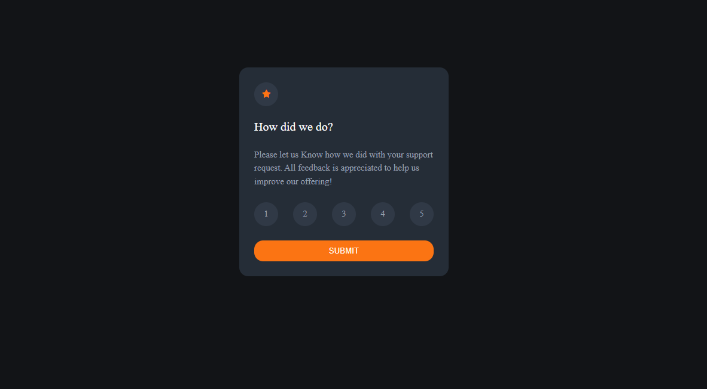
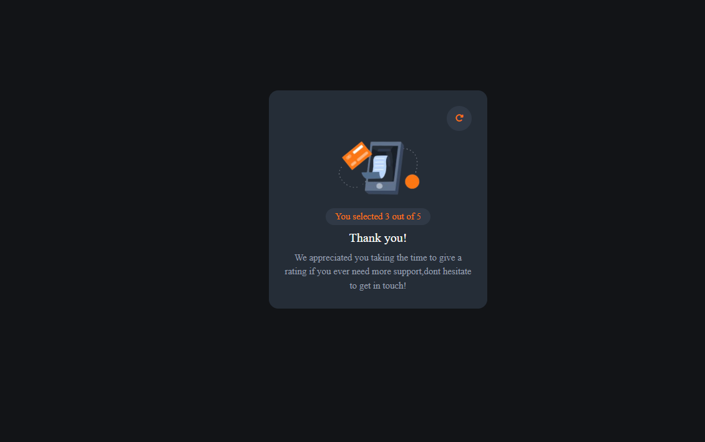

# Frontend Mentor - Interactive rating component solution

This is a solution to the [Interactive rating component challenge on Frontend Mentor](https://www.frontendmentor.io/challenges/interactive-rating-component-koxpeBUmI). Frontend Mentor challenges help you improve your coding skills by building realistic projects.

## Overview

### Screenshot

### Links

- Solution URL: [repo](https://github.com/youssefa111/-Frontend-Mentor---Interactive-rating-component-solution)
- Live Site URL: [live page](https://youssefa111.github.io/qr-component-challenge/)

### Built with

- Semantic HTML5 markup
- CSS custom properties
- javascript

### Continued development

Javascript - typescript - angular.js
